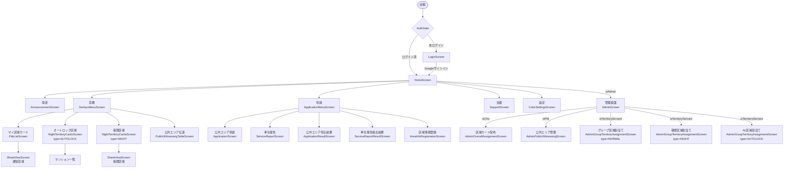
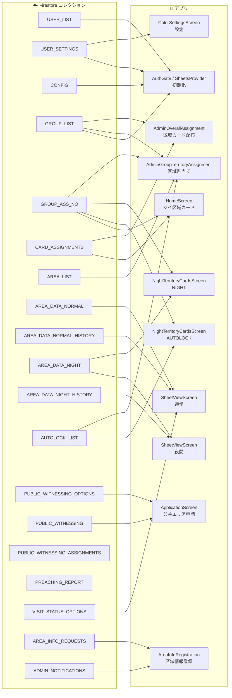
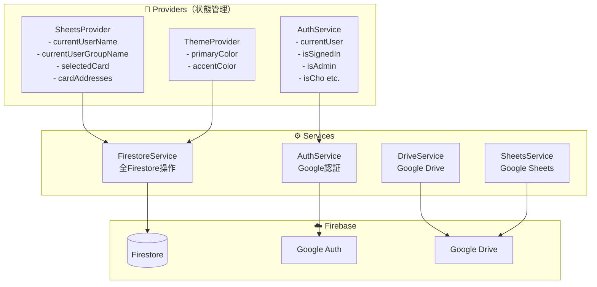

# 唐木田APP アーキテクチャ

## 図1：画面遷移フロー

## 図2：Firestore コレクション × 利用画面（表）

| Firestoreコレクション | 初期化 | マイ区域 | 通常区域 | 夜間区域 | AL区域 | 公共申請 | 区域割当て | カード配布 | 区域情報登録 | 設定 |
|---|:---:|:---:|:---:|:---:|:---:|:---:|:---:|:---:|:---:|:---:|
| USER_LIST | ✓ | | | | | | | | | |
| USER_SETTINGS | ✓ | | | | | | | | | ✓ |
| CONFIG | ✓ | | | | | | | | | |
| GROUP_LIST | ✓ | | | | | | ✓ | ✓ | | |
| GROUP_ASS_NO | | ✓ | | | ✓ | | ✓ | | | |
| CARD_ASSIGNMENTS | | ✓ | | | | | | ✓ | | |
| AREA_LIST | | | | | | | ✓ | | | |
| AREA_DATA_NORMAL | | | ✓ | | | | | | | |
| AREA_DATA_NORMAL_HISTORY | | | ✓ | | | | | | | |
| AREA_DATA_NIGHT | | | | ✓ | | | | | | |
| AREA_DATA_NIGHT_HISTORY | | | | ✓ | | | | | | |
| AUTOLOCK_LIST | | | | | ✓ | | ✓ | | | |
| PUBLIC_WITNESSING_OPTIONS | | | | | | ✓ | | | | |
| PUBLIC_WITNESSING | | | | | | ✓ | | | | |
| VISIT_STATUS_OPTIONS | | | ✓ | | | | | | | |
| AREA_INFO_REQUESTS | | | | | | | | | ✓ | |
| ADMIN_NOTIFICATIONS | | | | | | | | | ✓ | |

## 図2：Firestore コレクション × 利用画面（グラフ）

## 図3：Provider / Service 構造

